# Building-and-Deploying-Churn-Prediction-Model-Using-IBM-Watson-Studio
This project demonstrates how to build and deploy a machine learning model using Watson Auto AI. Watson Auto AI allows you to build and deploy machine learning models without writing a single line of code, making it a powerful tool for quickly developing production-grade models.

# Introduction:
In this project, I developed a churn prediction model using IBM Watson Studio. Churn prediction is a critical task for businesses, as it helps them identify customers who are likely to leave and take proactive measures to retain them. I used the Telco Customer Churn dataset from Kaggle to train and deploy the model.

# Step-by-Step-Guide:

## **Step 1:** Sign up for Watson Studio

## **Step 2:**  Create a Project and Setup Watson Auto AI

**Create a Project:** Begin by creating a new project in IBM Watson Studio. 

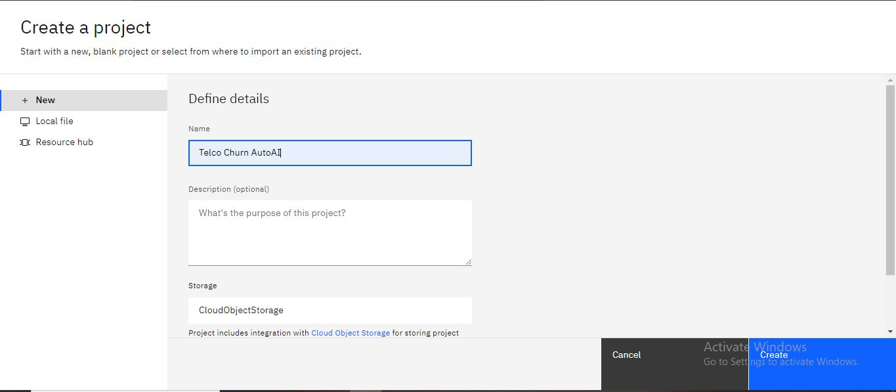 

**Add Auto AI Experiment:** Add a new Auto AI experiment to your project. 

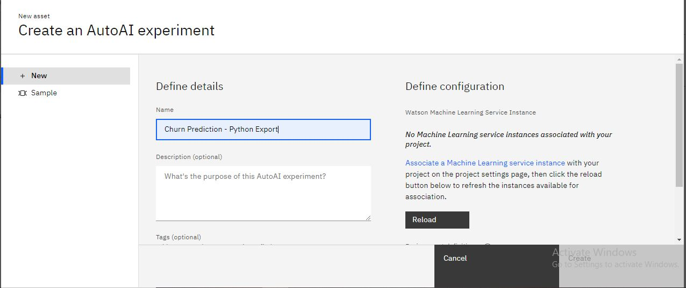 

**Associate Machine Learning Service:** Associate a Watson Machine Learning service with your project. If you don't have one, you can create a new service. 

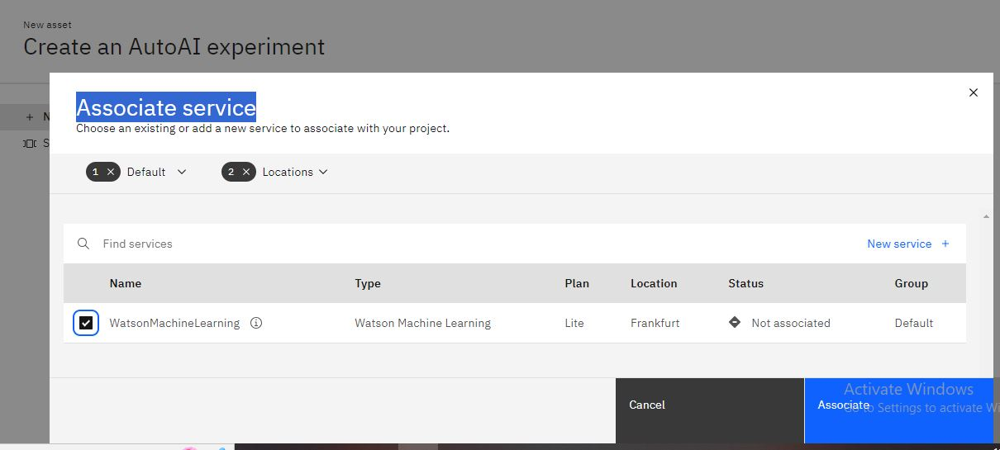 

## **Step 3:** Upload Your Data and Choose the Target
**Upload Dataset:** Upload your dataset to Watson Studio. For this project, I am using the [Telco Customer Churn Dataset from Kaggle](https://www.kaggle.com/datasets/blastchar/telco-customer-churn/data?select=WA_Fn-UseC_-Telco-Customer-Churn.csv) 

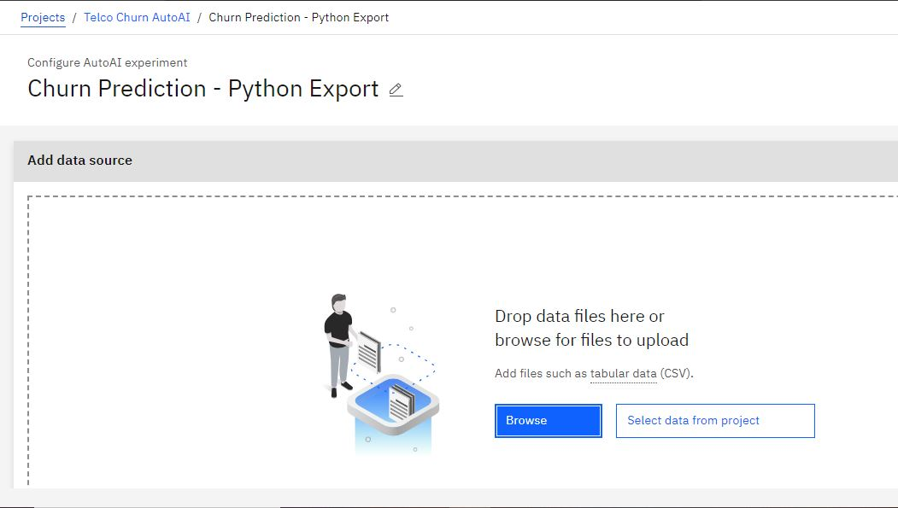 

**Choose Target Variable:** Select the target variable for your model. In the Telco Customer Churn dataset, the target variable is 'Churn', which indicates whether the customer stays or leaves. 

 

## **Step 4:** Run the Auto AI Experiment
**Run Experiment:** Start the Auto AI experiment. Auto AI will automatically select the most appropriate machine learning approach based on your dataset. 

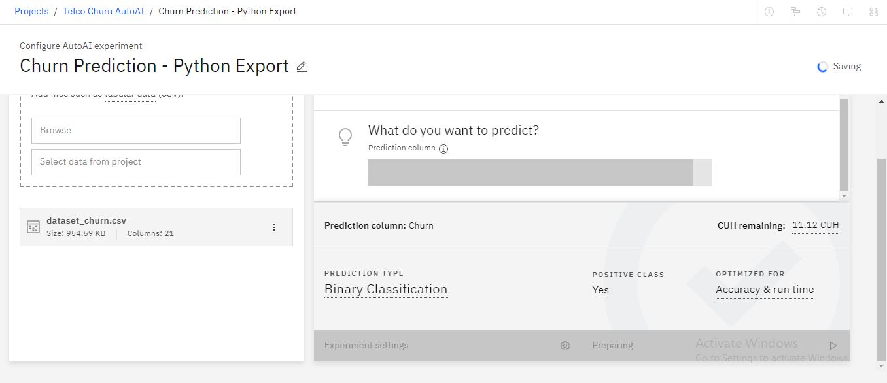 

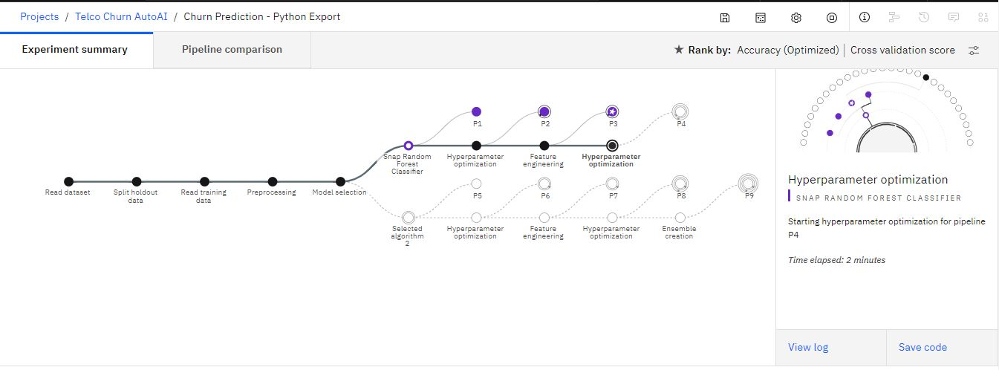 

**Evaluate Model Performance:** As the experiment runs, you can view the performance of the model in real-time. Auto AI will continue to tune the model to improve performance. 

 

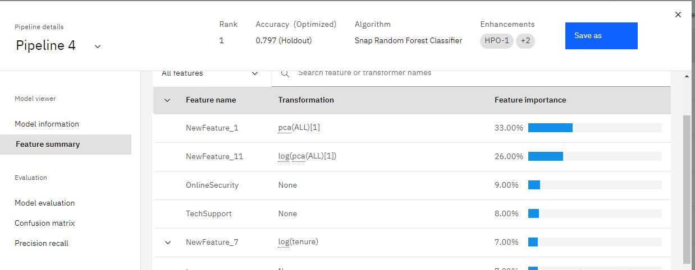 

## **Step 5:** Deploy Your Auto AI Model
**Save the Model:** Once the experiment is complete, save the model. Select the highest ranking model and click 'Save as model'. 

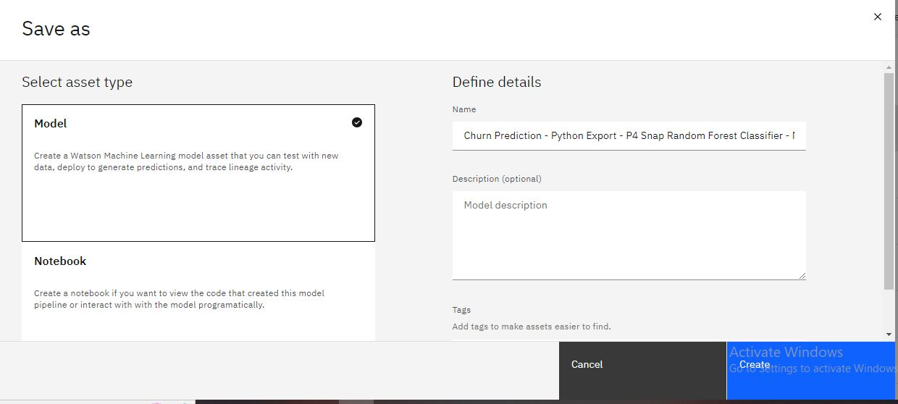 

**Deploy the Model:** Deploy the model for use in production. You can deploy the model via REST API and access it using a variety of languages including cURL, Java, Python, Javascript, and Scala. 

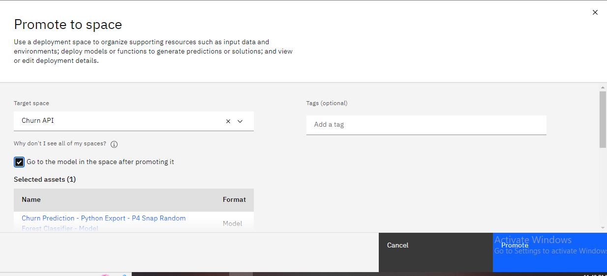 

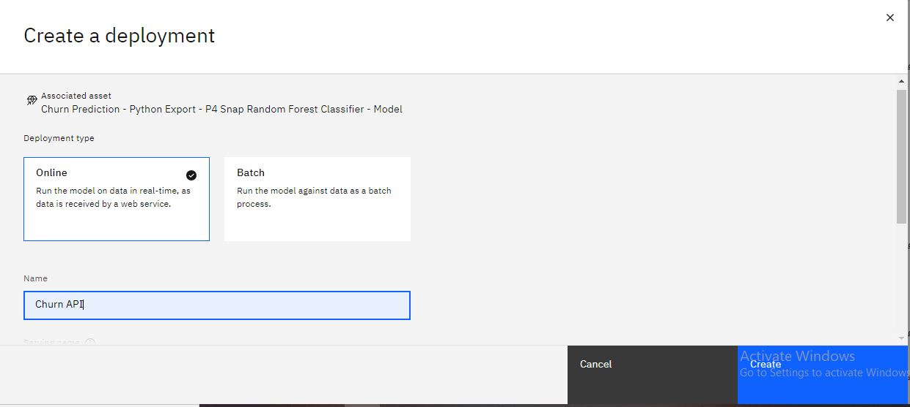 

## **Step 6:** Test the Model

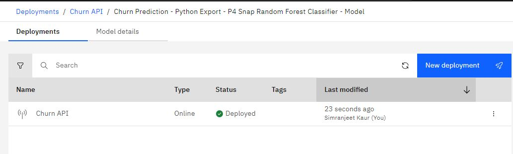 

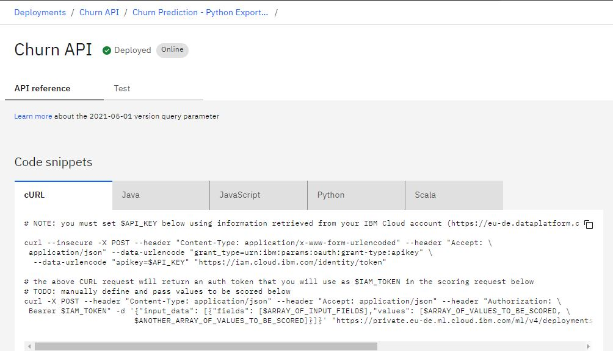 

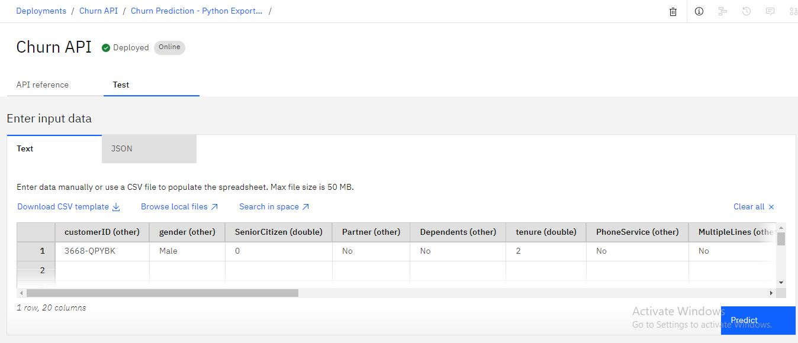 

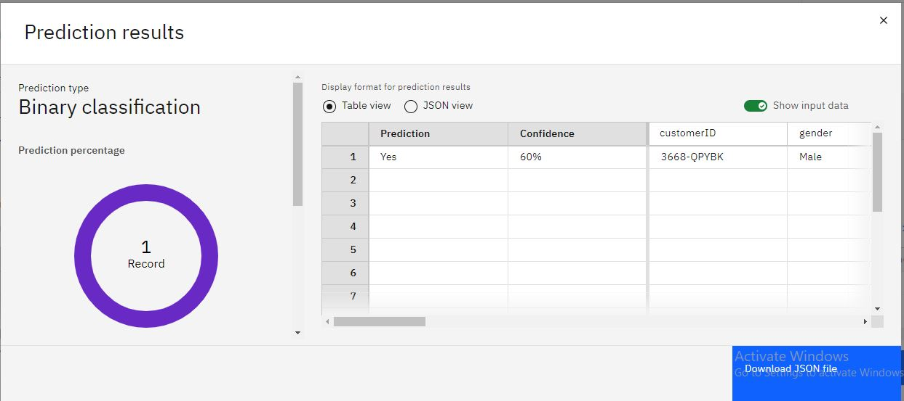 

By following these steps, you can quickly and efficiently build and deploy a machine learning model using Watson Auto AI. This project demonstrates the power of Auto AI in automating the machine learning model building process and making it accessible to users without extensive data science expertise.

