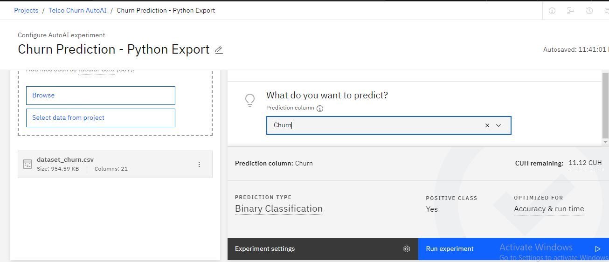
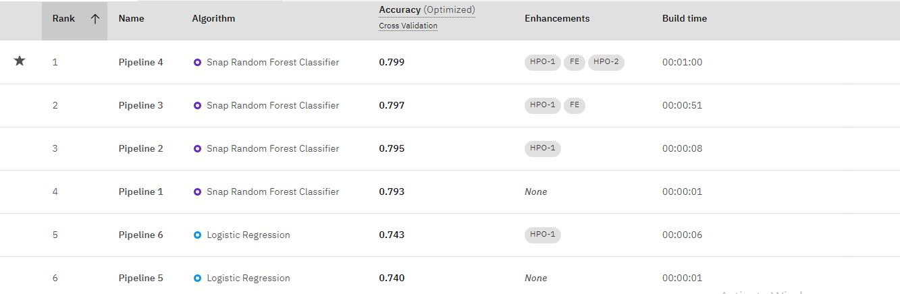

# Building-and-Deploying-Churn-Prediction-Model-Using-IBM-Watson-Studio
This project demonstrates how to build and deploy a machine learning model using Watson Auto AI. Watson Auto AI allows you to build and deploy machine learning models without writing a single line of code, making it a powerful tool for quickly developing production-grade models.

# Introduction:
In this project, I developed a churn prediction model using IBM Watson Studio. Churn prediction is a critical task for businesses, as it helps them identify customers who are likely to leave and take proactive measures to retain them. I used the Telco Customer Churn dataset from Kaggle to train and deploy the model.

# Step-by-Step Guide:

## **Step 1:** Sign up for Watson Studio
Sign up for IBM's [Watson Studio](https://www.ibm.com/products/watson-studio?utm_content=SRCWW&p1=Search&p4=43700079344871072&p5=e&gad_source=1&gclid=CjwKCAjwh4-wBhB3EiwAeJsppDlIjD8B17O6lHYD5QOv_kuENe-wWW7GpYcUNOvJEd30YBj_bPzTiBoCDVwQAvD_BwE&gclsrc=aw.ds)

## **Step 2:**  Create a Project and Setup Watson Auto AI

**Create a Project:** Begin by creating a new project in IBM Watson Studio. 

 

**Add Auto AI Experiment:** Add a new Auto AI experiment to your project. 

 

**Associate Machine Learning Service:** Associate a Watson Machine Learning service with your project. If you don't have one, you can create a new service. 

 

## **Step 3:** Upload Your Data and Choose the Target
**Upload Dataset:** Upload your dataset to Watson Studio. For this project, I am using the [Telco Customer Churn Dataset from Kaggle](https://www.kaggle.com/datasets/blastchar/telco-customer-churn/data?select=WA_Fn-UseC_-Telco-Customer-Churn.csv) 

 

**Choose Target Variable:** Select the target variable for your model. In the Telco Customer Churn dataset, the target variable is 'Churn', which indicates whether the customer stays or leaves. 

 

## **Step 4:** Run the Auto AI Experiment
**Run Experiment:** Start the Auto AI experiment. Auto AI will automatically select the most appropriate machine learning approach based on your dataset. 

 
AutoAI doesn't just create a single model but explores and tunes multiple configurations for better performance. It explores various algorithms, tunes them for optimal performance, and creates different model configurations, ultimately presenting you with the best options for tackling customer churn. 

 

**Evaluate Model Performance:** As the experiment runs, you can view the performance of the model in real-time. Auto AI will continue to tune the model to improve performance. 

 

Finally, AutoAI evaluates all the generated pipelines (different combinations of algorithms, hyperparameter tuning, and feature engineering) based on metrics relevant to churn prediction, like AUC-ROC or F1 score. It then ranks them based on their performance, allowing you to choose the best option for deployment. 

 

## **Step 5:** Deploy Your Auto AI Model
**Save the Model:** After the experiment, save the best-performing model for deployment. You can also save the experiment as a notebook for reproducibility or customization. 

 

**Deploy the Model:** Watson Studio allows you to deploy the saved model as a web service. This enables real-time predictions on new data. Refer to the Watson Studio documentation for detailed deployment instructions covering various programming languages.

 

 

 

## **Step 6:** Test the Model
Now it's time to test its mettle. You can feed the testing data into the model, and it generates churn predictions for the customer.  These predictions essentially indicate the likelihood of each customer churning in the future. 
Go to the deployments and select the model.

 
Enter the input data and click on the "Predict" button.

 
The results can be shown either in a tabular form or as a json view. The results can also be downloaded as a json file.

 

By following these steps, you can quickly and efficiently build and deploy a machine learning model using Watson Auto AI. This project demonstrates the power of Auto AI in automating the machine learning model building process and making it accessible to users without extensive data science expertise.Remember, this is just a starting point – explore Watson Studio's documentation and tutorials to delve deeper into its functionalities and refine your churn prediction strategy.

